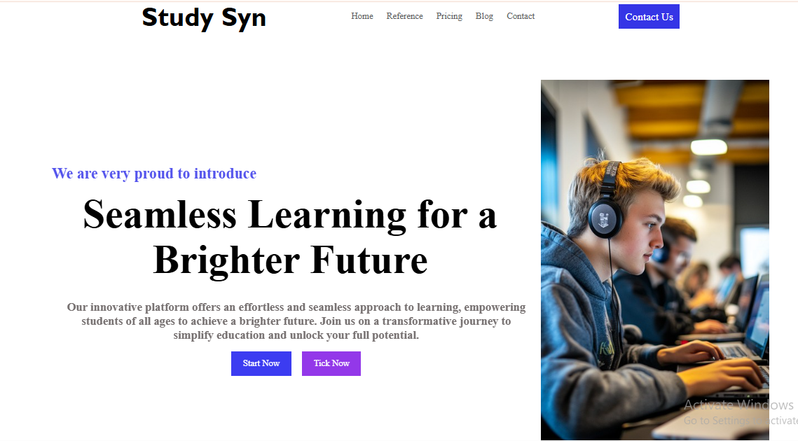
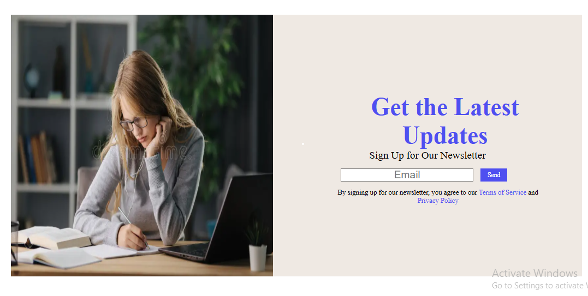

# Study Sync

A modern and responsive **Study Sync website** designed to provide an engaging learning experience. Built with **HTML and CSS**, this project focuses on clean layouts, attractive visuals, and a user-friendly interface that works smoothly across different screen sizes.

## 🚀 Features

* Responsive website design
* Hero section with attractive layout
* Organized content sections
* Modern navigation menu
* Clean and simple user interface
* CSS styling and animations

## 🛠️ Technologies Used

* HTML5
* CSS3

## 🌐 Live Demo

[Study Sync Project](https://github.com/TahiraDev691/study-sync-project)

## 📸 Preview

## 👩‍💻 Author

**Tahira**
Front-End Developer
