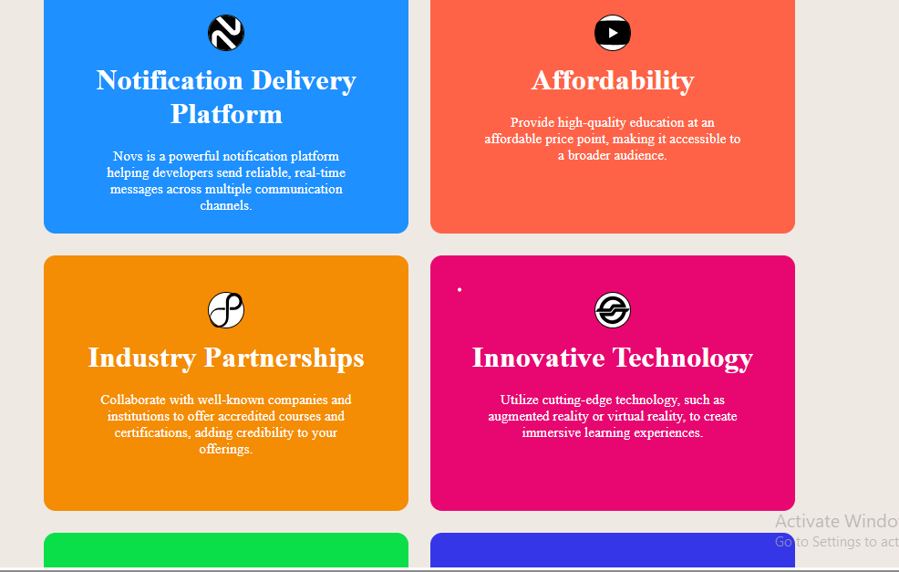
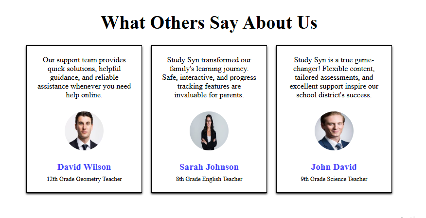

# Study Sync
A modern and responsive **Study Sync** website designed to provide an engaging learning experience. Built with **HTML and CSS**, this project focuses on clean layouts, attractive visuals, smooth animations, and a user-friendly interface that works seamlessly across different screen sizes.

The website uses **CSS animations and transitions** to create interactive and engaging elements. **Media queries** are implemented to ensure a fully responsive design that adapts smoothly to desktops, tablets, and mobile devices, providing a consistent user experience across all screen sizes.

## 🚀 Features

* Responsive website design
* Hero section with attractive layout
* Organized content sections
* Modern navigation menu
* Clean and simple user interface
* CSS styling and animations
* Use of media query to make it responsive

## 🛠️ Technologies Used

* HTML5
* CSS3

## 🌐 Live Demo

[Study Sync Project](https://github.com/TahiraDev691/study-sync-project)

## 📸 Preview

## 👩‍💻 Author

**Tahira**
Front-End Developer
